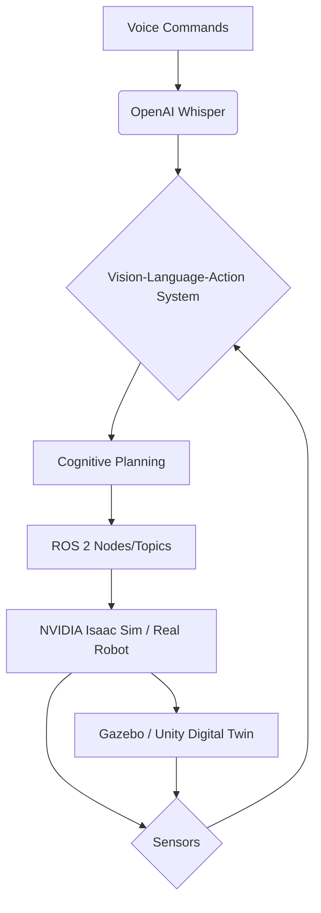
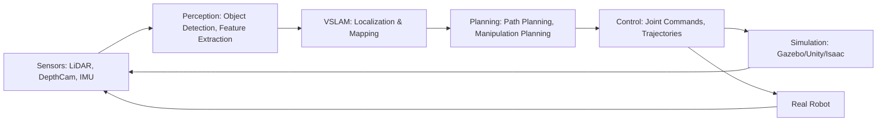

# Implementation Plan: Physical AI & Humanoid Robotics Hackathon Book

**Branch**: `1-physical-ai-robotics` | **Date**: 2025-12-07 | **Spec**: ./spec.md
**Input**: Feature specification from `/specs/[###-feature-name]/spec.md`

**Note**: This template is filled in by the `/sp.plan` command. See `.specify/templates/commands/plan.md` for the execution workflow.

## Summary

This plan outlines the technical approach for creating a "Physical AI & Humanoid Robotics Hackathon Book." The book will guide university-level students, AI enthusiasts, and educators in applying AI to control humanoid robots in simulated and real-world environments. It will integrate ROS 2, Gazebo/Unity, NVIDIA Isaac, and Vision-Language-Action models, enabling robots to navigate, perceive, and manipulate objects based on voice commands.

## Technical Context

**Language/Version**: Python 3.x (for ROS 2 rclpy, OpenAI Whisper integration, RL) and potentially C++ (for high-performance ROS 2 nodes, robotics libraries). Decision needed.
**Primary Dependencies**: ROS 2 (Humble/Iron), Gazebo (latest), Unity (latest), NVIDIA Isaac Sim (latest), OpenAI Whisper API/library, Python libraries (e.g., TensorFlow/PyTorch for RL, robotics-specific libraries).
**Storage**: N/A (book content, not an application with persistent storage).
**Testing**: Manual verification of code examples and simulations, automated testing for Python code where applicable.
**Target Platform**: Ubuntu Linux (for ROS 2 and Gazebo), Windows/macOS (for Unity development), NVIDIA Jetson/Orin (for real robot deployment).
**Project Type**: Documentation/Educational Content (Markdown files for Docusaurus).
**Performance Goals**: N/A (book content). Focus on clear explanations and runnable code examples.
**Constraints**:
- Word count: 5000-8000 words (Markdown source).
- Format: Markdown with diagrams and runnable code snippets, structured for Docusaurus.
- Sources: Official documentation for ROS 2, Gazebo, NVIDIA Isaac, Jetson, and research papers on Physical AI.
- Timeline: Complete within 6 weeks (hackathon schedule).
**Scale/Scope**: 8-12 chapters, covering ROS 2, Digital Twin, AI-Robot Brain, and VLA systems.

## Constitution Check

*GATE: Must pass before Phase 0 research. Re-check after Phase 1 design.*

-   **I. Accuracy**: All technical explanations and instructions will be verified against official documentation. (Pass)
-   **II. Clarity**: Writing style will be simple English, beginner-friendly, and easy to understand for students with basic web development knowledge. (Pass)
-   **III. Reproducibility**: Every code example will be tested and runnable, with clear commands provided. (Pass)
-   **IV. Practical Focus**: The book will focus on real project workflows and avoid unnecessary theoretical discussions. (Pass)
-   **V. Structure and Format**: The book will follow a proper book format (chapters, sections, code blocks) using Markdown for Docusaurus, with 8-12 chapters, each including explanation, example, diagram description (with alt-text), and practice task. (Pass)
-   **VI. Originality and Verification**: All content will be original and plagiarism-free. Diagrams will be described with alt-text. (Pass)

## Project Structure

### Documentation (this feature)

```text
specs/[###-feature]/
├── plan.md              # This file (/sp.plan command output)
├── research.md          # Phase 0 output (/sp.plan command)
├── data-model.md        # Phase 1 output (/sp.plan command)
├── quickstart.md        # Phase 1 output (/sp.plan command)
├── contracts/           # Phase 1 output (/sp.plan command)
└── tasks.md             # Phase 2 output (/sp.tasks command - NOT created by /sp.plan)
```

### Source Code (repository root)
<!--
  ACTION REQUIRED: Replace the placeholder tree below with the concrete layout
  for this feature. Delete unused options and expand the chosen structure with
  real paths (e.g., apps/admin, packages/something). The delivered plan must
  not include Option labels.
-->

```text
book/
├── docs/                 # Docusaurus documentation root
│   ├── intro.md          # Preface/Introduction
│   ├── chapter1-ros2.md  # ROS 2 (Robotic Nervous System)
│   ├── chapter2-digital-twin.md # Digital Twin (Gazebo & Unity)
│   ├── chapter3-isaac.md # AI-Robot Brain (NVIDIA Isaac)
│   ├── chapter4-vla.md   # Vision-Language-Action (VLA)
│   ├── ...               # Additional chapters (8-12 total)
│   └── capstone.md       # Capstone project chapter
├── blog/                 # Optional: for related blog posts
├── src/                  # Docusaurus source (components, pages)
├── static/               # Static assets (images, diagrams)
├── docusaurus.config.js  # Docusaurus configuration
└── sidebar.js            # Docusaurus sidebar configuration
```

**Structure Decision**: The project will utilize a Docusaurus-based structure, where book content is organized into Markdown files under `book/docs/`. Code examples will be embedded within these Markdown files or referenced from a `code-examples/` directory (to be created later). Diagrams will be described textually within the Markdown files, with alt-text. This structure supports easy navigation, search, and deployment as a static website.


## Architecture Sketch

### High-Level System Interaction



*Alt-text: A high-level architecture diagram showing the flow from Voice Commands through OpenAI Whisper, a Vision-Language-Action (VLA) System, Cognitive Planning, ROS 2, and into NVIDIA Isaac Sim or a Real Robot. Sensors feed back into the VLA System, and the Digital Twin (Gazebo/Unity) also connects to Sensors and the Robot/Simulation.*

### Data Flow: Sensors → Perception → VSLAM → Planning → Control → Simulation → Real Robot



*Alt-text: A data flow diagram illustrating the sequence from Sensors (LiDAR, DepthCam, IMU) to Perception (Object Detection, Feature Extraction), then to VSLAM (Localization & Mapping), followed by Planning (Path Planning, Manipulation Planning), and finally to Control (Joint Commands, Trajectories). Control outputs feed into both Simulation (Gazebo/Unity/Isaac) and Real Robot, both of which feedback to Sensors, completing the loop.*

### Book Workflow Architecture

```mermaid
graph TD
    User[Reader/Learner] --> Book[Physical AI & Robotics Book (Docusaurus)]
    Book --> Chapter[Chapter (Markdown)]
    Chapter --> Explanation[Explanation of Concepts]
    Chapter --> RunnableExample[Runnable Code Example]
    Chapter --> DiagramDescription[Diagram Description (with Alt-text)]
    Chapter --> PracticeTask[Practice Task/Exercise]
    RunnableExample --> Verification[Verified Code Execution]
    PracticeTask --> Feedback[Self-Assessment/Expected Outcome]
    Book --> Preface[Preface]
    Book --> Glossary[Glossary]
    Book --> Appendix[Appendix]
    Book --> CapstoneChapter[Capstone Project Chapter]
    Book --> ExternalDocs[Official Documentation: ROS 2, Gazebo, Isaac Sim, Whisper]
    ExternalDocs --> Research[Research-Concurrent Approach]
```

*Alt-text: A workflow diagram for the book architecture. The User interacts with the Book (Docusaurus). The Book consists of Chapters, Preface, Glossary, Appendix, and a Capstone Chapter. Each Chapter includes Explanation, Runnable Code Example, Diagram Description (with Alt-text), and a Practice Task. Runnable Examples lead to Verified Code Execution. Practice Tasks lead to Self-Assessment/Expected Outcome. The book's content is informed by Research-Concurrent Approach, which draws from External Documentation (ROS 2, Gazebo, Isaac Sim, Whisper).*


> **Fill ONLY if Constitution Check has violations that must be justified**

| Violation | Why Needed | Simpler Alternative Rejected Because |
|-----------|------------|-------------------------------------|
| [e.g., 4th project] | [current need] | [why 3 projects insufficient] |
| [e.g., Repository pattern] | [specific problem] | [why direct DB access insufficient] |
